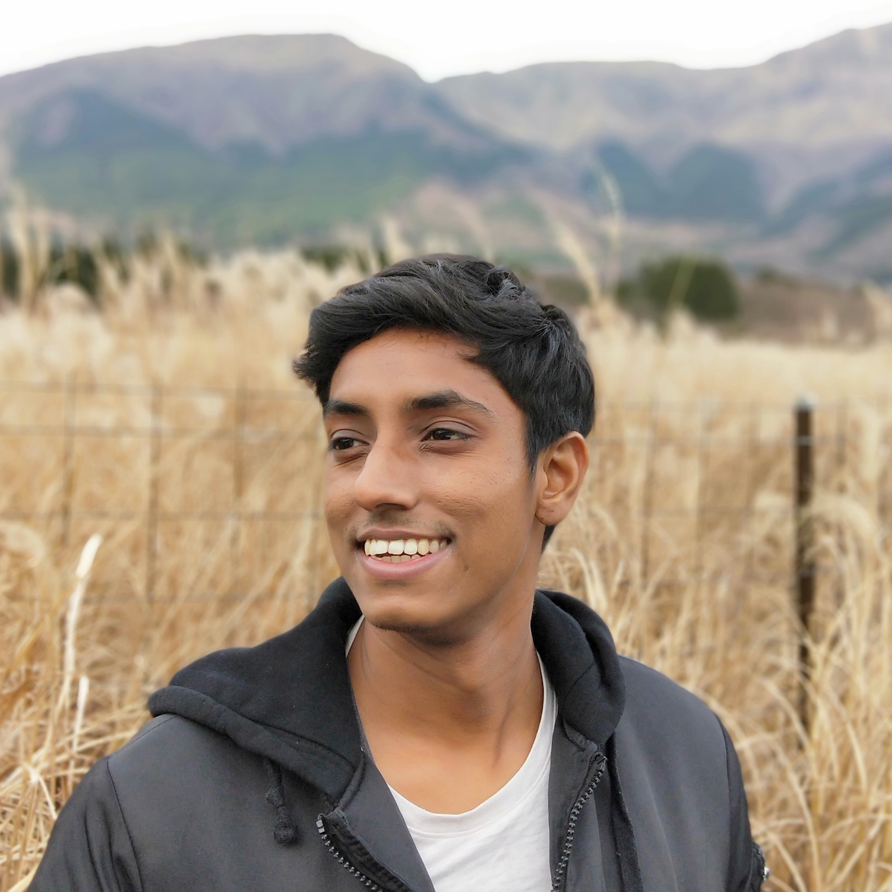

## Welcome to Ganesh's page!

 <a href="./files/ICLR25_PlaceFields_Learning-7.pdf">[New Preprint Alert! Kumar, M. G., Bordelon, B., Zavatone-Veth, J., Pehlevan, C. (2024). A Model of Place Field Reorganization During Reward Maximization.]</a> 

 

### Research interests

As we experience the world, our brain learns internal models of the world so that we can solve new problems quickly.
How do neural circuits and algorithms learn these models, and how do we decide the next best action? 
It has also been proposed that distortions to these internal models and learning algorithms contribute to psychiatric disorders. 
Can we develop mathematical models to understand these phenomena? 
Can we improve existing artificial systems and devise tools to alleivate disorders?
 
 
To explore these questions, I develop artificially intelligent agents, grounded to theory and experiments, 
to understand learning computations for intelligence, and when it might fail. 
Based on these insights, I hope to improve existing artificial systems, and develop technologies that can improve learning outcomes and alleviate learning disabilities.

### Research background

Currently, I am a postdoctoral fellow in the Harvard Machine Learning Foundations Group, 
developing reinforcement learning agents to understand representational learning in biological and artificial systems. I am advised by 
<a href="https://pehlevan.seas.harvard.edu/people/cengiz-pehlevan">Cengiz Pehlevan</a>, 
<a href="https://seas.harvard.edu/person/demba-ba">Demba Ba</a>,
<a href="http://lucasjanson.fas.harvard.edu/">Lucas Janson</a> and
<a href="https://www.boazbarak.org/">Boaz Barak</a>. 
 
 
Previously, I was a research scientist at the Centre for Frontier AI Research (CFAR), A*STAR developing 
vision-language reasoning datasets and models. I was advised by 
<a href="https://www.a-star.edu.sg/cfar/about-cfar/our-team/dr-cheston-tan">Cheston Tan</a>.
 
 
In 2022, I completed my Ph.D. in Computational Neuroscience at the National University of Singapore (NUS) 
under the Integrative Sciences and Engineering Programme (ISEP).
My doctoral thesis was to develop a biologically plausible reinforcement learning agent that learned 
new paired associations after a single example. 
I was co-advised by <a href="https://nus.edu.sg/lsi/principal-investigators-3/dr-andrew-tan-yong-yi/">Andrew Tan</a> and 
<a href="https://cde.nus.edu.sg/idp/staff/yen-shih-cheng/">Shih-Cheng Yen</a> and collaborated with 
<a href="http://camilolibedinsky.com/">Camilo Libedinsky</a>. 
 
 
I completed my B.Sc in Life Sciences in 2017 at the National University of Singapore where 
I worked on Brain-Computer Interfaces to control wheelchair using either human EEG or macaque intracortical spike data.
 
 
Besides research, I co-founded <a href="https://nugen.ai">Nugen.ai</a> that hopes to characterize 
affective states during learning to aid parents and teachers in personalizing education. 
I also love to tour either on my <a href="https://news.nus.edu.sg/record-breaking-trip-to-gain-experience/">motorcycle</a> or backpacking, 
and be involved in the <a href="https://news.nus.edu.sg/news-reports/sangae-muzhangu-won-gold-saadhana-project-won-platinum">arts</a> scene.

### Experience

- **2024**: Analytical Connectionism Summer School, Center for Computational Neuroscience, Flatiron Institute

- **2023 - 2025**: Postdoctoral Fellow (Theory of representational learning), School of Engineering and Applied Sciences, Harvard University 

- **2022 - 2023**: Research Scientist (Vision-Language reasoning), Centre for Frontier AI Research, A*STAR

- **2018 - 2022**: Ph.D. Candidature (Biologically plausible One-shot learning), National Unviersity of Singapore

- **2019**: Center for Brains, Minds and Machines (CBMM) Summer School 2019, Massachusetts Institute of Technology

- **2017 - 2018**: Research Engineer (Social roles & relationships recognition), A\*STAR Artificial Intellignce Initiative (A\*AI)

- **2013 - 2017**: [B.Sc. Life Sciences + University Scholars Programme (USP) + Special Programme in Science (SPS)](https://www.facebook.com/nus.singapore/videos/10155508729748540/)

### Selected Full Publications

- Kumar, M. G., Bordelon, B., Zavatone-Veth, J., Pehlevan, C. (2024). A Model of Place Field Reorganization During Reward Maximization. ***Preprint*** <a href="./files/ICLR25_PlaceFields_Learning-7.pdf">[Preprint]</a>

- Lin, Z.\*, Azaman, H.\*, Kumar, M. G., Tan, C. (2024). Composing Word Groups using Visually Grounded Reinforcement Learning. ***Computer Vision and Pattern Recognition (CVPR) workshops 2024*** [https://arxiv.org/abs/2309.04504](https://arxiv.org/abs/2309.04504) [[GitHub](https://github.com/haidiazaman/RL-concept-learning-project)] <a href="./files/RL_compositionality_CVPR24.pdf">[Poster]</a>

- Kumar, M. G., Ayyadhury, S., Murugan, E. (2024). Trends Innovations Challenges in Employing Interdisciplinary Approaches to Biomedical Sciences. In: Parthasarathy, K., Manikkam, R. (eds) Translational Research in Biomedical Sciences: Recent Progress and Future Prospects. ***Springer, Singapore***. [https://doi.org/10.1007/978-981-97-1777-4_20](https://doi.org/10.1007/978-981-97-1777-4_20)

- Lee, C.\*, Kumar, M. G.\*, Tan, C. (2023). DetermiNet: A Large-Scale Diagnostic Dataset for Complex Visually-Grounded Referencing using Determiners. ***International Conference on Computer Vision (ICCV) 2023*** [https://arxiv.org/abs/2309.03483](https://arxiv.org/abs/2309.03483) [[GitHub](https://github.com/clarence-lee-sheng/DetermiNet)] <a href="./files/ICCV23_Poster.pdf">[Poster]</a>

- Kumar, M. G., Tan, C., Libedinsky, C., Yen, S. C., & Tan, A. Y. Y. (2023). One-shot learning of paired association navigation with biologically plausible schemas. ***arXiv preprint arXiv:2106.03580***. [https://arxiv.org/abs/2106.03580](https://arxiv.org/abs/2106.03580) [[GitHub](https://github.com/mgkumar138/schema4one)] <a href="./files/RL@Harvard Ganesh Poster 290823.pdf">[Poster]</a>

- Kumar, M. G., Tan, C., Libedinsky, C., Yen, S. C., & Tan, A. Y. Y. (2022). A nonlinear hidden layer enables actor-critic agents to learn multiple paired association navigation. ***Cerebral Cortex***. [https://doi.org/10.1093/cercor/bhab456](https://doi.org/10.1093/cercor/bhab456) [[GitHub](https://github.com/mgkumar138/TDHL_6PA)]

- Kumar M. G., Kai Keng Ang, Rosa Q. So. (2017). Reject Option to reduce False Detection Rates for EEG-Motor Imagery based BCI. In Engineering in Medicine and Biology Society, EMBC 2017. ***39th Annual International Conference of the IEEE***. [https://doi.org/10.1109/EMBC.2017.8037479](https://doi.org/10.1109/EMBC.2017.8037479)

- Kumar M. G. (2023). Biologically plausible computations underlying one-shot learning of paired associations . ***Scholarbank@NUS***. [https://scholarbank.nus.edu.sg/handle/10635/238485](https://scholarbank.nus.edu.sg/handle/10635/238485) <a href="./files/KumarMG_2022.pdf">[Thesis]</a>

### Conferences
- Cognitive Computational Neuroscience (CCN) 2024: Kumar & Pehlevan (2024). Place fields organize along goal trajectory with reinforcement learning. CCN Abstracts 2024. [[ShortPaper](https://2024.ccneuro.org/pdf/289_Paper_authored_CCN24_place_fields_goal_RL-4.pdf)] <a href="./files/CCN_poster_090824.png">[Poster]</a>
- Neuroscience Singapore 2022, Society for Neuroscience Singapore Chapter [Oral] 
- Computational and Systems Neuroscience (COSYNE) 2022: Kumar et al. (2022). One-shot learning of paired associations by a reservoir computing model with Hebbian plasticity. Cosyne Abstracts 2022. <a href="./files/Kumar_2022_One-shot learning of paired associations by a reservoir computing model with Hebbian plasticity.pdf">[ShortPaper]</a>
- Neuroscience meeting 2021, Society for Neuroscience (SfN) [Poster]
- Neuroscience to Artificially Intelligent Systems (NAIsys) 2020, Cold Spring Harbour Laboratory [Poster]
- Neuromatch conference 1.0 2020, Neuromatch Academy [Oral]
- Bernstein Conference 2019, Bernstein Network Computational Neuroscience [Poster]

### Awards

- Postdoctoral Fellowship in Computer Science 2023, Harvard University
- Annual Symposium of the Society for Neuroscience 2022, Singapore Chapter - Best Flash Talk 
- [CBMM-Fujitsu Laboratories Fellow 2019](https://cbmm.mit.edu/summer-school/fellows)
- Graduate School Scholarship 2018, National University of Singapore
- [NUSSU Medal for Outstanding Achievement 2017](https://www.usp.nus.edu.sg/curriculum/awards-and-recognition/award-winners-of-class-2017/)
- University Scholars Programme (USP) Senior Honor Roll 2017
- Undergraduate Scholarship 2013, A\*STAR 

### Contact

Look forward to connecting with you!
+ [Email](m_ganeshkumar{at}u{dot}nus{dot}edu)
+ [X ](https://twitter.com/mgkumar138)
+ [LinkedIn](https://www.linkedin.com/in/m-ganesh-kumar/)
+ [ORCID](https://orcid.org/0000-0001-5559-6428) 
+ [Google Scholar](https://scholar.google.com/citations?hl=en&user=sFfy1q4AAAAJ)
+ [Semantic Scholar](https://www.semanticscholar.org/author/M-Ganesh-Kumar/48465210)
+ [GitHub](https://github.com/mgkumar138)
+ <a href="./files/Resume_Ganesh_200424.pdf">CV</a>
